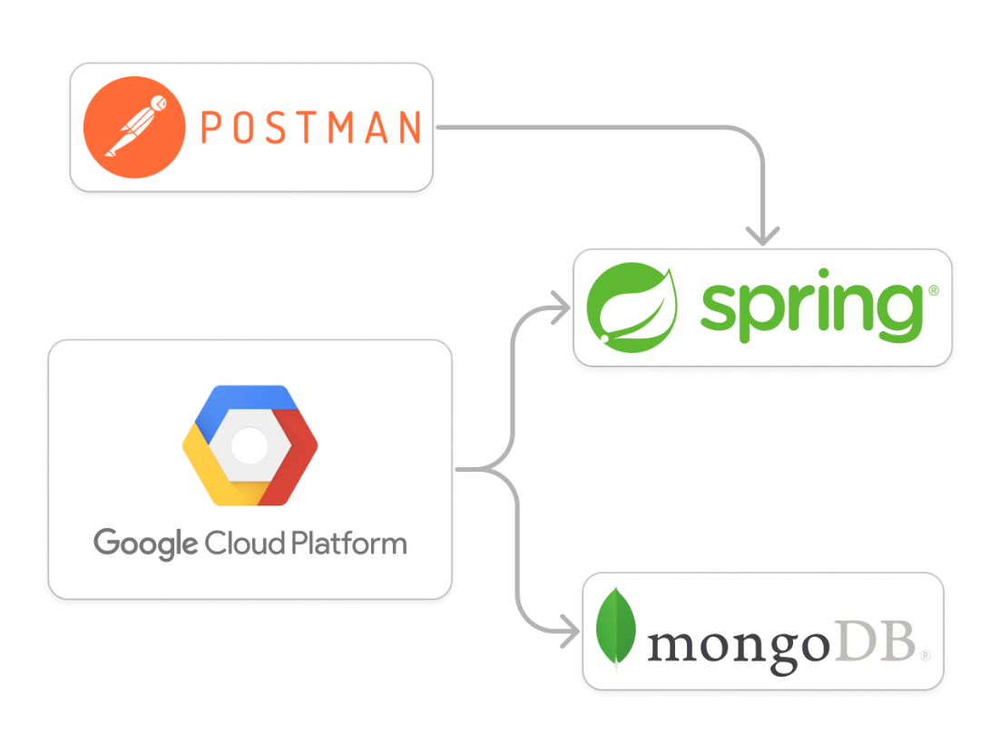

# 🗄 ️Social Network project 

**Teacher :** Maxime D’Halluin
   
**Students :** BARBARY Théo ⚙️ and THIBAUT Martin 🦋
    
### ⭐️ Goals :

    - Create a NoSQL database using MongoDB and some sharding on Google Cloud Platform 
    - Create a backend using SpringBoot to communicate with database 
    - Give a PostMan project that contains some requests that will be presented bellow 

### 🔧 Requests asked (in french) :

    1.  Créer 300 utilisateurs avec un login unique, un mot de passe, une description, une photo. La photo devra être un lien vers un fichier accessible par requête http. Le stockage de la photo devra être effectué dans une des bases de données, pas sur système de fichier.  
    2. Proposer et implémenter une requête http (getUser) permettant d’afficher un utilisateur par son login. 
    3.  Proposer et implémenter une requête http (getAllUsers) permettant de lister tous les utilisateurs, paginée avec une limite de 30. 
    4.  Créer des liens d’amitié entre les utilisateurs. Chaque utilisateur doit avoir entre 3 et 20 amis. 
    5.  Proposer et implémenter une requête http (getFriends) permettant de lister les liens d’amitié pour un utilisateur donné. 
    6.  Proposer et implémenter une requête http (addFriend) permettant d’ajouter un lien d’amitié avec un autre utilisateur par son login. 
    7.  Proposer et implémenter une requête http (removeFriend) permettant de supprimer un lien d’amitié entre les utilisateurs. 
    8.  Proposer et implémenter une requête http (addTchat) permettant de discuter avec un autre utilisateur.  
    9.  Proposer et implémenter une requête permettant d’afficher une conversation entre deux utilisateurs. 
    10. Proposer et implémenter une requête permettant de récupérer les messages de conversation non encore reçus d’un utilisateur. 
    11. Proposer et implémenter une requête permettant de rechercher des utilisateurs par leur description. 
    12. Proposer et implémenter un système de stockage des logs d’évènement utilisateur. Attention aux événements double comme la création d’un lien d’amitié. Cela impacte deux utilisateurs pour une même action. 
    13. Proposer et implémenter une requête permettant de lister tous les événements subvenus sur un utilisateur.  
    14. Proposer et implémenter la capacité pour un utilisateur de faire un post textuel (addPost) sur le réseau social. 
    15. Proposer et implémenter une requête permettant de lister tous les posts (getAllPost) d’un utilisateur. 
    16. Proposer et implémenter une requête permettant d’afficher un flux d’actu (getActu) pour un utilisateur correspondant à tous les posts de ses amis triés par ordre chronologique du plus récent post au plus ancien.  

